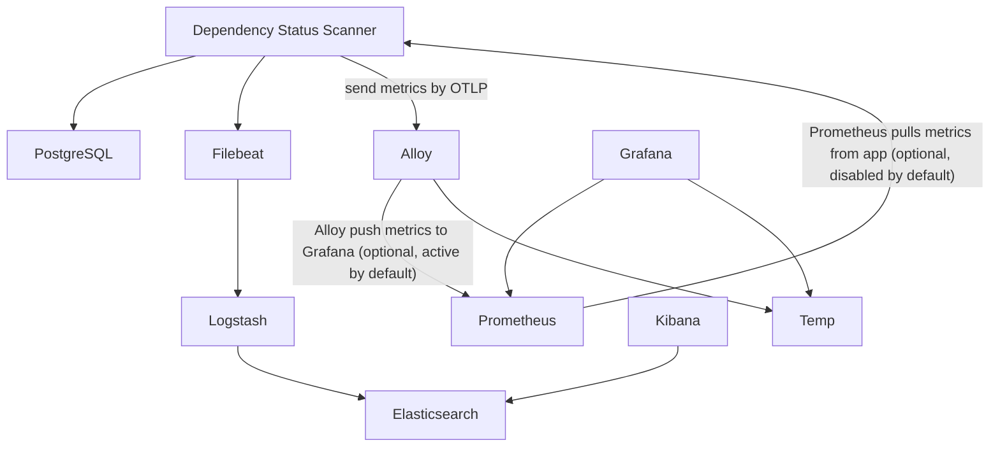
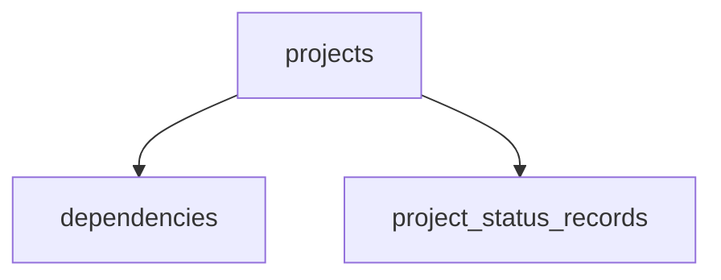

# Dependency status scanner



```mermaid
graph TD;
    Dependency&nbspStatus&nbspScanner-->PostgreSQL;
    Dependency&nbspStatus&nbspScanner-->Filebeat;
    Prometheus-->|Prometheus pulls metrics from app &#40optional, disabled by default&#41|Dependency&nbspStatus&nbspScanner;
    Filebeat-->Logstash;
    Logstash-->Elasticsearch;
    Kibana-->Elasticsearch;
    Dependency&nbspStatus&nbspScanner-->|send metrics by OTLP|Alloy;
    Alloy-->|Alloy push metrics to Grafana &#40optional, active by default&#41|Prometheus;
    Alloy-->Temp;
    Grafana-->Prometheus;
    Grafana-->Temp;
```


## Providers

| Id                | Description                       | Parameters                                                                                    |
|-------------------|-----------------------------------|-----------------------------------------------------------------------------------------------|
| `GITHUB_PROVIDER` | Project data provider from GitHub | `project_provider_id_1` - GitHub account<br> `project_provider_id_2` - GitHub repository name |

## DB diagram


```mermaid
graph TD;
    projects-->dependencies;
    projects-->project_status_records;
```

## Swagger

Swagger is available by default through http://localhost:8080/api-docs-ui.

## Building container image

Building a container image (multistage build with copied gradle wrapper to use the same version of gradle):

```shell
docker build -t mikbac/dependency-status-scanner:1.0 .
```

Running docker compose app (with postgres, ELK stack and observability):

```shell
docker compose -f ./docker/dss.yaml \
  --profile postgres-db \
  --profile elk  \
  --profile dss-app  \
  --profile observability  \
  up -d
```

## Postgres & ELK & Observability

### Docker compose

Running docker compose with postgres and Filebeat (recommended for local development):

```shell
docker compose -f ./docker/dss.yaml \
  --profile postgres-db \
  --profile filebeat  \
  --profile observability  \
  up -d
```

Running docker compose with postgres, ELK (Filebeat + Logstash + Elasticsearch + Kibana)
and observability (Alloy + Prometheus + Tempo + Grafana) stack:

```shell
docker compose -f ./docker/dss.yaml \
  --profile postgres-db \
  --profile elk  \
  --profile observability  \
  up -d
```

### Kibana

Logs are passed from the application to Filebeat and then to Logstash. Logstash provides logs to Elasticsearch with
index pattern:
`%{[@metadata][beat]}-%{[@metadata][version]}-%{[log_info][project_origin]}-%{+YYYY-MM-dd}` e.g.
`filebeat-8.15.1-dependency_status_scanner-*` (`filebeat-8.15.1-dependency_status_scanner-2024-12-27`).

Kibana is available via http://localhost:5601/. A sample data view is included in the `kibana`
catalog ([Kibana-data-view](kibana/Kibana-data-view.ndjson)).


## Metrics

Actuator metrics are available via:

* Health: http://localhost:8081/actuator/health
* Flyway: http://localhost:8081/actuator/flyway
* Prometheus: http://localhost:8081/actuator/prometheus (disabled)

Prometheus http://localhost:9090/targets

Grafana http://localhost:3000/

## Upgrading gradle version

```shell
./gradlew wrapper --gradle-version <version>
# e.g.
./gradlew wrapper --gradle-version 8.12
```

## TODO

* [ ] OpenApi
* [ ] Hateos
* [ ] Redis
* [ ] Grafana - diagrams
* [ ] Split providers to modules + convention plugins (core + providers)
* [ ] Support for Cassandra/ScyllaDB
* [ ] Spring security - token
* [ ] BOM file import
* [ ] ArchUnit test
* [ ] GitLab connector
* [ ] Jacoco
* [ ] CQRS
* [ ] PMD gradle plugin
* [ ] OWASP dependency-check gradle plugin
* [ ] Automatically build and run unit tests
* [ ] Automatic deployment to dockerhub
* [ ] Spring Config Server
* [ ] Spring Security (with Keycloak)
* [ ] SpotBugs
* [ ] Vault for secrets
* [ ] Dependabot
