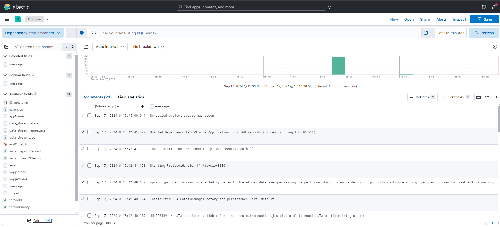

# Dependency status scanner

## Providers

| Id               | Description                       | Parameters                                                                                    |
|------------------|-----------------------------------|-----------------------------------------------------------------------------------------------|
| `githubProvider` | Project data provider from GitHub | `project_provider_id_1` - GitHub account<br> `project_provider_id_2` - GitHub repository name |

## Postgres & ELK

### Docker compose

```shell
docker compose -f ./docker/postgres.yaml up -d
docker compose -f ./docker/elk.yaml up -d
```

### Kibana

Logs are passed from the application to Filebeat and then to Logstash. Logstash uses index pattern
`%{[@metadata][beat]}-%{[@metadata][version]}-%{+YYYY-MM-dd}` e.g. `filebeat-8.15.1-*`.

Kibana is available via http://localhost:5601/. A sample data view is included in the `kibana`
catalog ([Kibana-data-view](kibana/Kibana-data-view.ndjson)).



## DB diagram


## TODO

* [ ] Circuit Breaker Resillience4j
* [ ] OpenApi
* [ ] Swagger
* [ ] Hateos
* [ ] Redis
* [ ] Grafana
* [ ] Split providers to modules
* [ ] Docker image (with specified user)
* [ ] Support for Cassandra/ScyllaDB
* [ ] Spring security - token
* [ ] BOM file import
* [ ] ArchUnit test
* [ ] GitLab connector
* [ ] Jacoco
